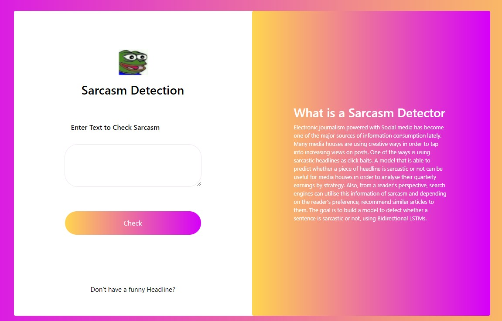
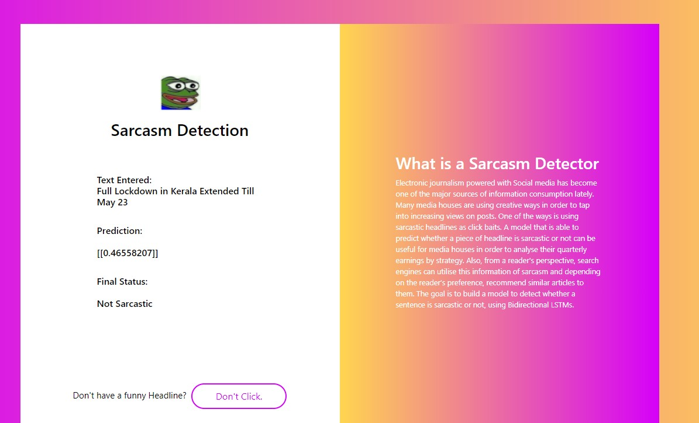

# Sarcasm-detector
### News Headline Sarcasm Detector
#### We built a model to detect whether a sentence is sarcastic or not, using Bidirectional LSTMs.

#### Try it out - https://sarcasmdetect.herokuapp.com/

Electronic journalism powered with Social media has become one of the major sources of information consumption lately. Many media houses are using creative ways in order to tap into increasing views on posts. One of the ways is using sarcastic headlines as click baits. A model that is able to predict whether a piece of headline is sarcastic or not can be useful for media houses in order to analyse their quarterly earnings by strategy. Also, from a reader's perspective, search engines can utilise this information of sarcasm and depending on the reader’s preference, recommend similar articles to them.

- Home Page

- Result Page

